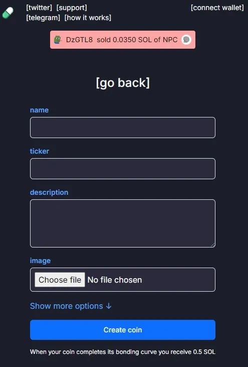

# PUMP.FUN

[Pump.fun](https://pump.fun) - Pump.fun is a protocol that allows anyone to create a token in minutes for free. To date, it has launched over 5.7 million tokens, and been responsible for up to 71 % of daily token launches on Solana.

## How do you create a token on Pump.fun?
- All users have to do to create a meme coin on Pump.fun is fill in a short form. 

The site requires you to enter a token name, ticker, description, and attach a photo, then click “create coin.” It really is that simple. Token creators can also choose to add a Twitter, Telegram, and website link, but this is entirely optional.

Previously, the site required creators to pay 0.02 SOL ($2.50 as of this writing), but in August 2024, the protocol removed this barrier making it completely free to launch tokens. In fact, now you’re rewarded with 0.5 SOL (approximately $95) if you create a token that completes its “bonding curve.”

## What is a bonding curve? 
- Once a token is created, its bonding curve will slowly fill as the market cap rises. Once the coin hits a market cap of $100,000, it will graduate to be traded on decentralized exchange Raydium with $17,000 worth of liquidity.

